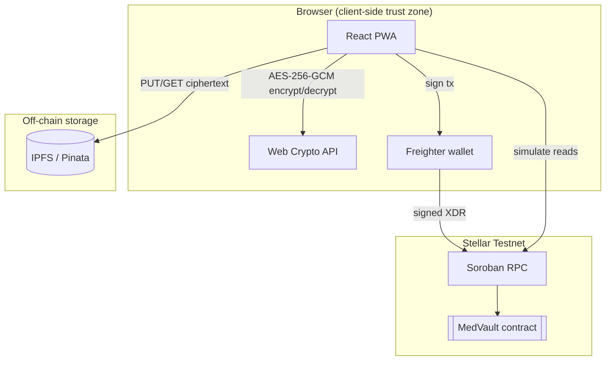
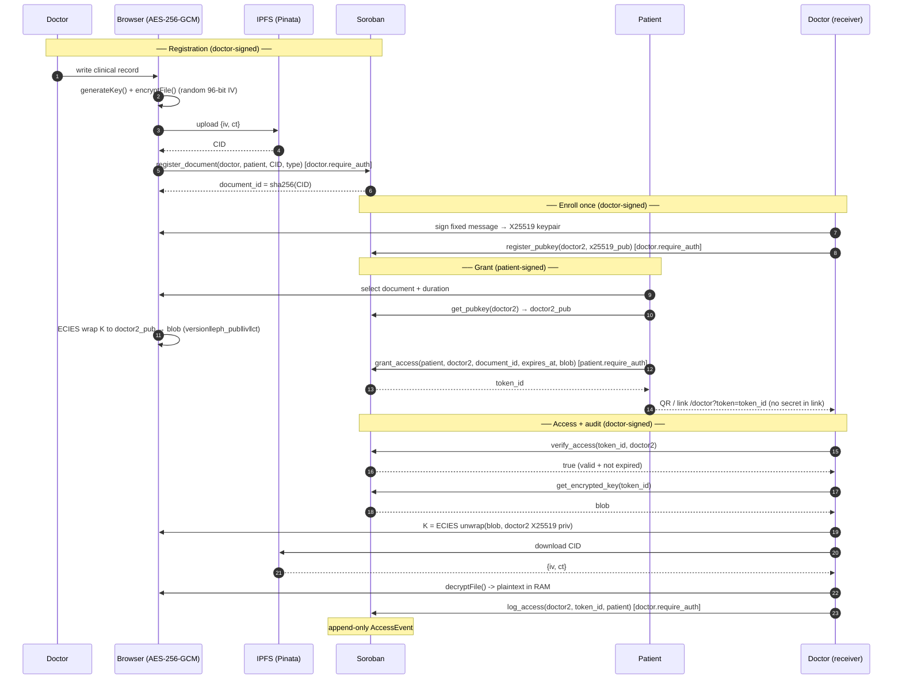

# MedVault — Architecture

Technical reference for the MedVault protocol: a patient-sovereign medical-records system where data is encrypted client-side, stored on IPFS, and gated by time-bound access tokens on a Stellar Soroban contract.

- **Network:** Stellar Testnet
- **Contract ID:** `CAENHTIXAUOJ3AIWINZP3RRJQNADCLQ4HCYJZZV5TFYWRK2WU5VHKCK3`
- **Contract:** Rust / Soroban SDK v26 — 14 functions, 22 unit tests
- **Frontend:** React 19 + TypeScript + Vite, PWA

### Contract deployments

| Version | Contract ID | Notes |
|---|---|---|
| `v0.5` · ECIES (active) | `CAENHTIXAUOJ3AIWINZP3RRJQNADCLQ4HCYJZZV5TFYWRK2WU5VHKCK3` | Adds `register_pubkey` / `get_pubkey` (X25519 key directory) — 14 functions, 22 tests |
| `v0.4` · KEM (previous) | `CBYNTUAVZ4OSILWID7HE6AYF7FNOJTT2M77TZJ6GUU32VGBXUCMIUBBK` | Kept for traceability — 12 functions, 20 tests, in-link wrapping key |

---

## 1. Design Principles

- **The chain stores references, never payloads.** Only content hashes (IPFS CIDs), wrapped keys, and access metadata live on-chain. No plaintext or ciphertext of a medical record ever touches Stellar.
- **Encryption is the privacy boundary, not read ACLs.** Soroban ledger state is world-readable by design; confidentiality is enforced by AES-256-GCM client-side, not by hiding reads.
- **Authorization is enforced where state changes.** Every mutating entry point calls `require_auth()` on the acting address, so writes are bound to a wallet signature at the protocol level.
- **No backend.** There is no application server. The browser talks directly to Soroban RPC, IPFS (Pinata), and the Freighter wallet. This removes a central trust point and a central breach target.

---

## 2. System Components



| Component | Responsibility | How |
|---|---|---|
| React PWA | UI, orchestration, crypto | Calls Web Crypto, IPFS, and Soroban from the browser; never persists plaintext |
| Web Crypto (`SubtleCrypto`) | Symmetric encryption + AES-GCM key wrapping | AES-256-GCM native; X25519 ECDH + HKDF via `@noble/curves` + `@noble/hashes` for ECIES |
| Freighter | Key custody + transaction signing | Holds the Stellar secret key; signs XDR; the app never sees private keys |
| IPFS (Pinata) | Ciphertext storage | Content-addressed; the CID is the integrity proof of the blob |
| Soroban contract | Registry, access tokens, audit log | Persistent/temporary storage + `require_auth` + ledger-time expiry |
| Soroban RPC | Submit signed tx / simulate reads | Writes go through `sendTransaction`; reads through `simulateTransaction` (no signature) |

---

## 3. On-Chain Data Model

Defined in `contracts/medvault/contracts/medvault/src/lib.rs`.

### Types

- **`Document`** — `{ doctor: Address, patient: Address, cid: String, doc_type: String, created_at: u64 }`
- **`AccessToken`** — `{ doctor: Address, patient: Address, document_id: BytesN<32>, expires_at: u64, encrypted_key: Bytes }`
- **`AccessEvent`** — `{ doctor: Address, token_id: BytesN<32>, accessed_at: u64 }`

### Storage keys (`DataKey`)

| Key | Storage class | Holds | Lifecycle |
|---|---|---|---|
| `Document(BytesN<32>)` | Persistent | Document metadata | Long-lived registry entry |
| `Token(BytesN<32>)` | **Temporary** | `AccessToken` (incl. wrapped key) | Network-evicted after TTL → self-expiring grants |
| `AuditLog(Address)` | Persistent | `Vec<AccessEvent>` | Append-only history per patient |
| `PatientDocs(Address)` | Persistent | `Vec<BytesN<32>>` | Document index per patient |
| `DoctorTokens(Address)` | Persistent | `Vec<BytesN<32>>` | Token index per doctor |

### Identifier derivation

- **`document_id`** = `sha256(cid_bytes)` — deterministic from the IPFS CID, so the same content maps to a stable on-chain key.
- **`token_id`** = `sha256(document_id || expires_at.to_be_bytes())` — binds a grant to a specific document and expiry; changing the duration yields a different token.

### Why temporary storage for tokens

- Soroban's temporary storage entries are removed by the network once their TTL lapses.
- Expiry therefore needs **no cron job and no server-side revocation**: an expired grant simply ceases to exist in state, and `verify_access` returns `false` for a missing token.

---

## 4. Cryptographic Design

### 4.1 Record encryption (AES-256-GCM)

Implemented in `frontend/src/lib/encryption.ts`.

- Algorithm: `AES-GCM`, 256-bit key, **96-bit (12-byte) IV randomly generated per encryption** (`crypto.getRandomValues`).
- GCM provides confidentiality **and** integrity: the 128-bit auth tag is verified on decrypt, so any tampering with the ciphertext on IPFS causes `decrypt` to throw.
- Payload serialization (`encodePayload`): `{ iv: base64, ct: base64 }` JSON — this exact blob is what is uploaded to IPFS.

### 4.2 Key encapsulation (ECIES + sign-to-derive) — v3, deployed

Implemented in `frontend/src/lib/ecies.ts`, `eckeys.ts`, and `doctorkey.ts`. The AES record key is wrapped to the **recipient's X25519 public key**, so unwrapping requires *being* the doctor's wallet — there is no copyable secret and nothing travels in the link or QR.

**Sign-to-derive (doctor enrolls once).** The doctor signs a fixed message with their wallet (`signMessageWithWallet`); the seed is `SHA-512(signature)[0..32]`, which becomes an X25519 private key. The private key is persisted locally (`localStorage: medvault_ec_keys`) so decryption never depends on `signMessage` being byte-deterministic across calls. The matching X25519 **public** key is published on-chain via `register_pubkey` — a wallet-indexed key directory.

**Wrap (patient grants access).**
- The patient reads the doctor's published key with `get_pubkey(doctorAddress)`. If none exists, the grant UI blocks with "this doctor hasn't enabled secure receiving yet."
- A fresh ephemeral X25519 keypair is generated per grant. The shared secret is `ECDH(eph_priv, doctor_pub)`, run through `HKDF-SHA256` (salt = `eph_pub`, info = `medvault-ecies-v3`) to a 256-bit AES-GCM key.
- The document AES key is encrypted under that derived key. The on-chain payload layout is:
  - `encrypted_key = version(0x03) || eph_pub(32) || iv(12) || ct(AES key + GCM tag)` → 1 + 32 + 12 + 48 = **93 bytes**.
- The blob is stored on-chain in `AccessToken.encrypted_key` (via `grant_access`).

**Unwrap (doctor reads).** The doctor re-loads their X25519 private key, recomputes `ECDH(doctor_priv, eph_pub)` and the same HKDF key, and AES-GCM-decrypts the document key — entirely client-side, in RAM.

```mermaid
sequenceDiagram
    participant D as Doctor (browser)
    participant SC as Soroban
    participant P as Patient (browser)

    Note over D: enroll once
    D->>D: sig = signMessage(fixed); priv = SHA-512(sig)[0..32]
    D->>SC: register_pubkey(doctor, x25519_pub(priv))

    Note over P: has AES record key K
    P->>SC: pub = get_pubkey(doctor)
    P->>P: eph = X25519 keygen; s = ECDH(eph_priv, pub)
    P->>P: dk = HKDF(s, salt=eph_pub, info=ecies-v3)
    P->>P: blob = 0x03 || eph_pub || iv || AES-GCM(K) under dk  (93B)
    P->>SC: grant_access(..., encrypted_key = blob)
    SC-->>P: token_id
    P-->>D: link  /doctor?token=token_id   (no secret in link)
    D->>SC: get_encrypted_key(token_id)
    SC-->>D: blob
    D->>D: s = ECDH(doctor_priv, eph_pub); K = AES-GCM-decrypt(blob)
    Note over D: K reconstructed in RAM only
```

The `version` byte distinguishes the v3 ECIES blob from the legacy v2 wrapping-key format, so the contract storage layout never changed.

### 4.3 Key custody summary

- **Record key (AES):** ephemeral in browser RAM; persisted only as ECIES-wrapped bytes on-chain.
- **Doctor X25519 private key:** derived from a wallet signature, persisted client-side only; the public half lives on-chain. Never transmitted.
- **Ephemeral X25519 key:** generated per grant; the public half is embedded in the blob, the private half is discarded after wrapping.
- **Stellar private key:** held by the wallet (Freighter et al.); the app requests signatures, never raw keys.

---

## 5. Authorization Model

`require_auth()` is called on the acting `Address` in every state-mutating function.

| Function | Authorizing address | Guarantees |
|---|---|---|
| `register_document` | `doctor` | Only the named doctor can register a document under their identity |
| `register_pubkey` | `owner` | Only the wallet itself can publish/replace its X25519 encryption public key |
| `grant_access` | `patient` | Only the record owner can mint an access token / store a wrapped key |
| `log_access` | `doctor` | Audit entries can only be written by the doctor performing the access — no forged attribution |
| `revoke_access` | `patient` | Only the patient can revoke; combined with the in-function `token.patient == patient` check, one patient cannot revoke another's grants |

**How it is satisfied at runtime**

- The frontend builds the invocation with the acting wallet as the **transaction source account** (`stellar.ts` → `buildAndSubmit(method, args, signerPublicKey)`).
- Soroban treats a source-account signature as authorization for `require_auth()` when the required address equals the source. The transaction is signed by Freighter, so the signature *is* the authorization — no separate auth entry is needed.
- A transaction that does not carry the required signature fails at the contract boundary before any state is written.

**Read functions carry no auth.** `verify_access`, `get_*`, and `verify_zkp_proof` are invoked via `simulateTransaction` (no signature). This is intentional: ledger state is public, so adding `require_auth` to reads would add a signing step without adding confidentiality. Privacy is delivered by §4 (encryption), not by read-side gating.

**Test evidence:** `test.rs` asserts the required signer per write via `env.auths()` (`test_register_document_requires_doctor_auth`, `test_grant_access_requires_patient_auth`, `test_log_access_requires_doctor_auth`, `test_revoke_access_requires_patient_auth`).

---

## 6. Contract Interface

### Writes (require auth)

- `register_document(doctor, patient, cid, doc_type) -> document_id` — stores `Document`, appends to `PatientDocs`. Auth: `doctor`.
- `register_pubkey(owner, pubkey)` — publishes/replaces the owner's X25519 encryption public key in the on-chain key directory. Auth: `owner`.
- `grant_access(patient, doctor, document_id, expires_at, encrypted_key) -> token_id` — stores `AccessToken` in temporary storage, appends to `DoctorTokens`. Auth: `patient`.
- `log_access(doctor, token_id, patient)` — appends an `AccessEvent` to the patient's persistent audit log. Auth: `doctor`.
- `revoke_access(patient, token_id)` — removes the token from temporary storage if `token.patient == patient`. Auth: `patient`.

### Reads (no auth, simulated)

- `verify_access(token_id, doctor) -> bool` — true iff token exists, `token.doctor == doctor`, and `ledger.timestamp() < expires_at`.
- `get_document(document_id) -> Option<Document>`
- `get_token_info(token_id) -> Option<AccessToken>`
- `get_pubkey(owner) -> Option<BytesN<32>>` — returns the owner's registered X25519 encryption public key, or `None` if not enrolled.
- `get_encrypted_key(token_id) -> Option<Bytes>` — returns the ECIES-wrapped AES key blob (`version‖eph_pub‖iv‖ct`).
- `get_audit_log(patient) -> Vec<AccessEvent>`
- `get_patient_documents(patient) -> Vec<BytesN<32>>`
- `get_doctor_tokens(doctor) -> Vec<BytesN<32>>`
- `verify_zkp_proof(...) -> bool` — see §8.

---

## 7. End-to-End Flows



---

## 8. Zero-Knowledge Verification (deployed)

The contract ships a **real Groth16 verifier** running on Stellar's native BLS12-381 host functions (CAP-0052), not a stub, and the proof is generated **client-side in the browser**.

- `verify_zkp_proof` performs the Groth16 pairing equation `e(-A, B) · e(α, β) · e(L, γ) · e(C, δ) == 1`, where `L = IC₀ + root · IC₁`.
- Implemented with `env.crypto().bls12_381()`: `g1_mul`, `g1_add`, and a single `pairing_check` over the four G1/G2 pairs. G1 points are deserialized from 96 bytes, G2 from 192 bytes, scalars from `Bls12381Fr`. The verification key is passed as a call argument, so the circuit can be rotated **without redeploying the contract**.
- **Use:** a doctor proves membership in an authorized set (Merkle root of credentialed providers) without revealing which doctor they are. Circuit: `merkle_membership_stellar.circom` (10 levels, 5615 constraints); Poseidon hashing runs over the BLS12-381 scalar field (CAP-0075 compatible).
- **Soundness:** `pathIndices` are constrained to `{0,1}` (`pathIndices[i]·(1-pathIndices[i])===0`) to close an under-constraint in circomlib's `Mux1`, which does not range-check its selector.
- **In-browser proving:** the Protocol page builds the Merkle tree, generates the Groth16 proof with snarkjs (wasm + zkey served statically), then calls `verify_zkp_proof` on the live contract — end-to-end in ~2 s. The circuit, the verifier reference, and the validation suite live in [`zkp-jwt/stellar/`](../zkp-jwt/stellar/README.md).

---

## 9. Trust Boundaries & Threat Model

| Threat | Mitigation | Mechanism |
|---|---|---|
| Record interception in transit | Client-side encryption | AES-256-GCM before any `fetch`; only ciphertext leaves the browser |
| Tampered ciphertext on IPFS | Authenticated encryption | GCM tag verification fails closed on decrypt |
| Unauthorized document registration | On-chain auth | `doctor.require_auth()` in `register_document` |
| Forged audit entries | On-chain auth | `log_access` requires the doctor's signature; attribution = signer |
| Cross-patient grant revocation | Auth + ownership check | `patient.require_auth()` + `token.patient == patient` |
| Stolen share link / token alone | ECIES to recipient key | The wrapped key only opens with the doctor's X25519 private key; the link carries no secret, and the on-chain blob is useless without that key |
| Off-app decryption with public reads | Recipient-bound encryption | `get_encrypted_key` is a public read, but the blob is sealed to the doctor's X25519 key — possessing it is not enough to decrypt |
| Expired-token replay | Consensus-time expiry | `verify_access` checks `ledger.timestamp()`; temporary storage evicts the token |
| Plaintext leakage to disk/cache | RAM-only decryption | No write to `localStorage`/`IndexedDB`; service worker excludes RPC/IPFS payloads |
| Private-key exposure to the app | External custody | Freighter signs; the app never receives secret keys |

**Residual / out-of-scope (current version)**

- The doctor's X25519 private key is persisted client-side (derived from a wallet signature). Cross-device use needs the doctor to re-enroll on each device, or a future encrypted key-escrow; loss of local storage means re-enrolling (new grants only).
- IPFS pin availability depends on the Pinata account; loss of pinning makes ciphertext unreachable (the on-chain registry still proves it existed).
- On-chain metadata (which addresses interacted, timestamps, doc_type) is public; it reveals relationship graphs even though content stays encrypted.

---

## 10. Cryptography Roadmap

| Version | Scheme | Property | Status |
|---|---|---|---|
| v1 | AES key in URL hash | Key off the wire (fragment), link-dependent | superseded |
| v2 | On-chain wrapped key (KEM) | Two-factor: chain token + link WK | superseded |
| v3 | ECIES + sign-to-derive (X25519 ECDH + on-chain pubkey directory) | No secret in the link at all; decrypt = being the recipient wallet | **deployed** |
| v4 | ZK Merkle membership (BLS12-381 + Poseidon) | Anonymous proof of authorization | on-chain verifier ready |

---

## 11. Repository Layout

```
medvault-stellar/
├── ARCHITECTURE.md                      # this document
├── README.md
├── contracts/medvault/
│   └── contracts/medvault/src/
│       ├── lib.rs                       # contract: 14 functions
│       └── test.rs                      # 22 unit tests
└── frontend/
    └── src/
        ├── lib/
        │   ├── encryption.ts            # AES-256-GCM record encryption
        │   ├── ecies.ts                 # ECIES wrap/unwrap (X25519 ECDH + HKDF + AES-GCM)
        │   ├── eckeys.ts                # X25519 keypair via sign-to-derive
        │   ├── doctorkey.ts             # enroll/publish/load recipient key
        │   ├── ipfs.ts                  # Pinata upload/download
        │   ├── stellar.ts               # contract client (writes signed, reads simulated)
        │   └── i18n.ts                  # EN/ES/PT
        ├── components/                  # PatientVault, DoctorAccess, QRGenerator, …
        └── pages/                       # Home, Patient, Doctor, Protocol, Hackathon
```

---

## 12. Build, Test, Deploy

```bash
# Contract
cd contracts/medvault
cargo test                              # 22 tests
stellar contract build                  # -> target/wasm32v1-none/release/medvault.wasm
stellar contract deploy \
  --wasm target/wasm32v1-none/release/medvault.wasm \
  --source <identity> --network testnet

# Frontend
cd frontend
cp .env.example .env.local              # set VITE_CONTRACT_ID, VITE_PINATA_JWT
npm install && npm run dev
```

After deploying a new contract, propagate the contract ID to: `frontend/.env.local`, the Vercel `VITE_CONTRACT_ID` env var, `README.md`, and the hardcoded constants in `frontend/src/pages/ProtocolPage.tsx` and `HackathonPage.tsx`.
