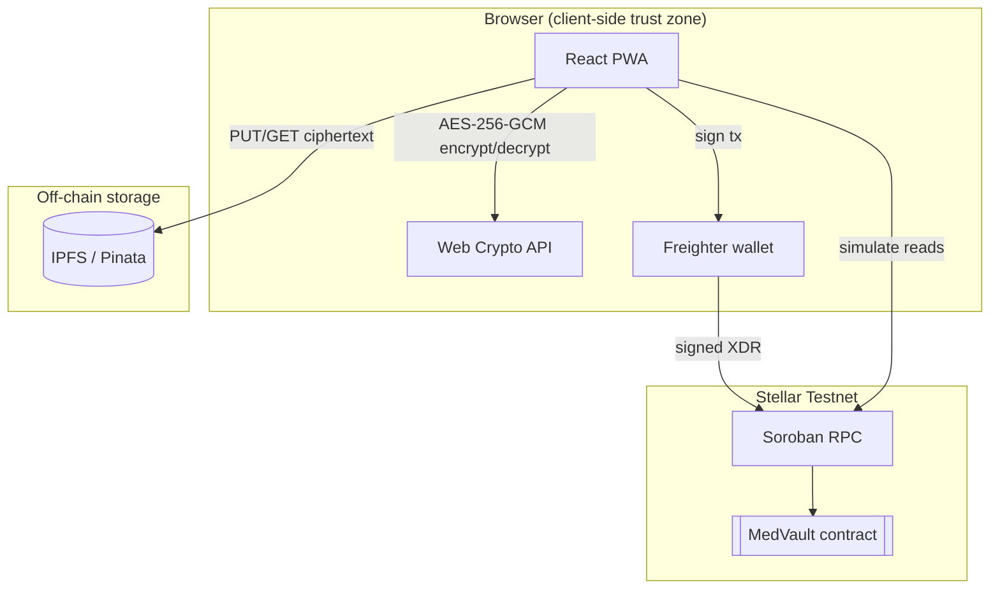
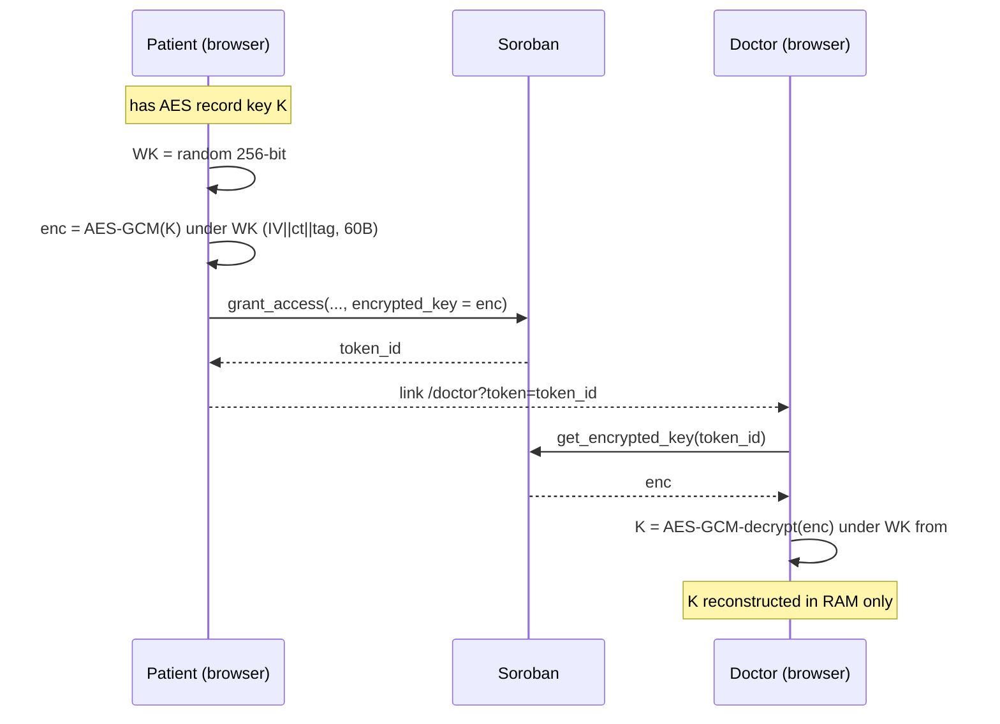

# MedVault — Architecture

Technical reference for the MedVault protocol: a patient-sovereign medical-records system where data is encrypted client-side, stored on IPFS, and gated by time-bound access tokens on a Stellar Soroban contract.

- **Network:** Stellar Testnet
- **Contract ID:** `CAB7UE4NE2PJHKDQJ4PXITOTHACPVSA2TQ6AMCNV2WZHIWTSZ5LU4B54`
- **Contract:** Rust / Soroban SDK v26 — 12 functions, 20 unit tests
- **Frontend:** React 19 + TypeScript + Vite, PWA

---

## 1. Design Principles

- **The chain stores references, never payloads.** Only content hashes (IPFS CIDs), wrapped keys, and access metadata live on-chain. No plaintext or ciphertext of a medical record ever touches Stellar.
- **Encryption is the privacy boundary, not read ACLs.** Soroban ledger state is world-readable by design; confidentiality is enforced by AES-256-GCM client-side, not by hiding reads.
- **Authorization is enforced where state changes.** Every mutating entry point calls `require_auth()` on the acting address, so writes are bound to a wallet signature at the protocol level.
- **No backend.** There is no application server. The browser talks directly to Soroban RPC, IPFS (Pinata), and the Freighter wallet. This removes a central trust point and a central breach target.

---

## 2. System Components



| Component | Responsibility | How |
|---|---|---|
| React PWA | UI, orchestration, crypto | Calls Web Crypto, IPFS, and Soroban from the browser; never persists plaintext |
| Web Crypto (`SubtleCrypto`) | Symmetric encryption + key wrapping | AES-256-GCM; no third-party crypto dependency |
| Freighter | Key custody + transaction signing | Holds the Stellar secret key; signs XDR; the app never sees private keys |
| IPFS (Pinata) | Ciphertext storage | Content-addressed; the CID is the integrity proof of the blob |
| Soroban contract | Registry, access tokens, audit log | Persistent/temporary storage + `require_auth` + ledger-time expiry |
| Soroban RPC | Submit signed tx / simulate reads | Writes go through `sendTransaction`; reads through `simulateTransaction` (no signature) |

---

## 3. On-Chain Data Model

Defined in `contracts/medvault/contracts/medvault/src/lib.rs`.

### Types

- **`Document`** — `{ doctor: Address, patient: Address, cid: String, doc_type: String, created_at: u64 }`
- **`AccessToken`** — `{ doctor: Address, patient: Address, document_id: BytesN<32>, expires_at: u64, encrypted_key: Bytes }`
- **`AccessEvent`** — `{ doctor: Address, token_id: BytesN<32>, accessed_at: u64 }`

### Storage keys (`DataKey`)

| Key | Storage class | Holds | Lifecycle |
|---|---|---|---|
| `Document(BytesN<32>)` | Persistent | Document metadata | Long-lived registry entry |
| `Token(BytesN<32>)` | **Temporary** | `AccessToken` (incl. wrapped key) | Network-evicted after TTL → self-expiring grants |
| `AuditLog(Address)` | Persistent | `Vec<AccessEvent>` | Append-only history per patient |
| `PatientDocs(Address)` | Persistent | `Vec<BytesN<32>>` | Document index per patient |
| `DoctorTokens(Address)` | Persistent | `Vec<BytesN<32>>` | Token index per doctor |

### Identifier derivation

- **`document_id`** = `sha256(cid_bytes)` — deterministic from the IPFS CID, so the same content maps to a stable on-chain key.
- **`token_id`** = `sha256(document_id || expires_at.to_be_bytes())` — binds a grant to a specific document and expiry; changing the duration yields a different token.

### Why temporary storage for tokens

- Soroban's temporary storage entries are removed by the network once their TTL lapses.
- Expiry therefore needs **no cron job and no server-side revocation**: an expired grant simply ceases to exist in state, and `verify_access` returns `false` for a missing token.

---

## 4. Cryptographic Design

### 4.1 Record encryption (AES-256-GCM)

Implemented in `frontend/src/lib/encryption.ts`.

- Algorithm: `AES-GCM`, 256-bit key, **96-bit (12-byte) IV randomly generated per encryption** (`crypto.getRandomValues`).
- GCM provides confidentiality **and** integrity: the 128-bit auth tag is verified on decrypt, so any tampering with the ciphertext on IPFS causes `decrypt` to throw.
- Payload serialization (`encodePayload`): `{ iv: base64, ct: base64 }` JSON — this exact blob is what is uploaded to IPFS.

### 4.2 Key encapsulation (KEM) — v2, deployed

Implemented in `frontend/src/lib/ecies.ts`. The AES record key is never transmitted or stored in clear.

- A fresh **256-bit wrapping key (WK)** is generated per grant (`generateWrappingKey`).
- The raw AES key is encrypted under the WK with AES-256-GCM (`encryptKeyWithWK`). The on-chain payload layout is:
  - `encrypted_key = IV(12 bytes) || GCM_ciphertext(AES key + tag)` → 12 + 32 + 16 = **60 bytes**.
- The **wrapped key is stored on-chain** in `AccessToken.encrypted_key` (via `grant_access`).
- The **WK travels only in the URL fragment** (`#wk=<base64>`). Browsers never send the fragment to any server, so the WK stays off the wire.

**Result — two independent factors are required to decrypt a record:**

1. The on-chain access token (the wrapped AES key) — fetched with `get_encrypted_key`.
2. The wrapping key from the share link fragment.

Possessing only one is useless: the link without the on-chain token has no ciphertext key; the chain without the link has only an AES key encrypted under an unknown WK.



### 4.3 Key custody summary

- **Record key (AES):** ephemeral in browser RAM; persisted only as ciphertext-wrapped bytes on-chain.
- **Wrapping key:** never stored; exists only inside the share URL fragment.
- **Stellar private key:** held by Freighter; the app requests signatures, never raw keys.

---

## 5. Authorization Model

`require_auth()` is called on the acting `Address` in every state-mutating function.

| Function | Authorizing address | Guarantees |
|---|---|---|
| `register_document` | `doctor` | Only the named doctor can register a document under their identity |
| `grant_access` | `patient` | Only the record owner can mint an access token / store a wrapped key |
| `log_access` | `doctor` | Audit entries can only be written by the doctor performing the access — no forged attribution |
| `revoke_access` | `patient` | Only the patient can revoke; combined with the in-function `token.patient == patient` check, one patient cannot revoke another's grants |

**How it is satisfied at runtime**

- The frontend builds the invocation with the acting wallet as the **transaction source account** (`stellar.ts` → `buildAndSubmit(method, args, signerPublicKey)`).
- Soroban treats a source-account signature as authorization for `require_auth()` when the required address equals the source. The transaction is signed by Freighter, so the signature *is* the authorization — no separate auth entry is needed.
- A transaction that does not carry the required signature fails at the contract boundary before any state is written.

**Read functions carry no auth.** `verify_access`, `get_*`, and `verify_zkp_proof` are invoked via `simulateTransaction` (no signature). This is intentional: ledger state is public, so adding `require_auth` to reads would add a signing step without adding confidentiality. Privacy is delivered by §4 (encryption), not by read-side gating.

**Test evidence:** `test.rs` asserts the required signer per write via `env.auths()` (`test_register_document_requires_doctor_auth`, `test_grant_access_requires_patient_auth`, `test_log_access_requires_doctor_auth`, `test_revoke_access_requires_patient_auth`).

---

## 6. Contract Interface

### Writes (require auth)

- `register_document(doctor, patient, cid, doc_type) -> document_id` — stores `Document`, appends to `PatientDocs`. Auth: `doctor`.
- `grant_access(patient, doctor, document_id, expires_at, encrypted_key) -> token_id` — stores `AccessToken` in temporary storage, appends to `DoctorTokens`. Auth: `patient`.
- `log_access(doctor, token_id, patient)` — appends an `AccessEvent` to the patient's persistent audit log. Auth: `doctor`.
- `revoke_access(patient, token_id)` — removes the token from temporary storage if `token.patient == patient`. Auth: `patient`.

### Reads (no auth, simulated)

- `verify_access(token_id, doctor) -> bool` — true iff token exists, `token.doctor == doctor`, and `ledger.timestamp() < expires_at`.
- `get_document(document_id) -> Option<Document>`
- `get_token_info(token_id) -> Option<AccessToken>`
- `get_encrypted_key(token_id) -> Option<Bytes>` — returns the wrapped AES key for KEM decryption.
- `get_audit_log(patient) -> Vec<AccessEvent>`
- `get_patient_documents(patient) -> Vec<BytesN<32>>`
- `get_doctor_tokens(doctor) -> Vec<BytesN<32>>`
- `verify_zkp_proof(...) -> bool` — see §8.

---

## 7. End-to-End Flows

```mermaid
sequenceDiagram
    participant D as Doctor
    participant B as Browser (AES-256-GCM)
    participant I as IPFS (Pinata)
    participant SC as Soroban
    participant P as Patient
    participant D2 as Doctor (receiver)

    rect rgb(240,246,255)
    Note over D,SC: Registration (doctor-signed)
    D->>B: write clinical record
    B->>B: generateKey() + encryptFile()  (random 96-bit IV)
    B->>I: upload {iv, ct}
    I-->>B: CID
    B->>SC: register_document(doctor, patient, CID, type)  [doctor.require_auth]
    SC-->>B: document_id = sha256(CID)
    end

    rect rgb(245,255,245)
    Note over P,SC: Grant (patient-signed)
    P->>B: select document + duration
    B->>B: WK = random; encrypted_key = wrap(K, WK)
    P->>SC: grant_access(patient, doctor2, document_id, expires_at, encrypted_key)  [patient.require_auth]
    SC-->>P: token_id
    P-->>D2: QR / link  /doctor?token=token_id#wk=WK
    end

    rect rgb(255,250,240)
    Note over D2,SC: Access + audit (doctor-signed)
    D2->>SC: verify_access(token_id, doctor2)
    SC-->>D2: true (valid + not expired)
    D2->>SC: get_encrypted_key(token_id)
    SC-->>D2: encrypted_key
    D2->>B: K = unwrap(encrypted_key, WK from #wk)
    D2->>I: download CID
    I-->>D2: {iv, ct}
    D2->>B: decryptFile() -> plaintext in RAM
    D2->>SC: log_access(doctor2, token_id, patient)  [doctor.require_auth]
    Note over SC: append-only AccessEvent
    end
```

---

## 8. Zero-Knowledge Roadmap

The contract already ships a **real Groth16 verifier** running on Stellar's native BLS12-381 host functions (CAP-0052), not a stub.

- `verify_zkp_proof` performs the Groth16 pairing equation `e(-A, B) · e(α, β) · e(L, γ) · e(C, δ) == 1`, where `L = IC₀ + root · IC₁`.
- Implemented with `env.crypto().bls12_381()`: `g1_mul`, `g1_add`, and a single `pairing_check` over the four G1/G2 pairs. G1 points are deserialized from 96 bytes, G2 from 192 bytes, scalars from `Bls12381Fr`.
- **Target use:** a doctor proves membership in an authorized set (Merkle root of credentialed providers) without revealing which doctor they are. Circuit: `merkle_membership.circom`; Poseidon hashing is available natively (CAP-0075).
- Integration-level proof generation/verification is exercised out-of-repo in `zkp-jwt/`; the on-chain function here is the verification endpoint.

---

## 9. Trust Boundaries & Threat Model

| Threat | Mitigation | Mechanism |
|---|---|---|
| Record interception in transit | Client-side encryption | AES-256-GCM before any `fetch`; only ciphertext leaves the browser |
| Tampered ciphertext on IPFS | Authenticated encryption | GCM tag verification fails closed on decrypt |
| Unauthorized document registration | On-chain auth | `doctor.require_auth()` in `register_document` |
| Forged audit entries | On-chain auth | `log_access` requires the doctor's signature; attribution = signer |
| Cross-patient grant revocation | Auth + ownership check | `patient.require_auth()` + `token.patient == patient` |
| Stolen share link alone | KEM split-custody | Link holds only the WK; without the on-chain token there is no key ciphertext |
| Stolen on-chain token alone | KEM split-custody | Token holds an AES key encrypted under an unknown WK |
| Expired-token replay | Consensus-time expiry | `verify_access` checks `ledger.timestamp()`; temporary storage evicts the token |
| Plaintext leakage to disk/cache | RAM-only decryption | No write to `localStorage`/`IndexedDB`; service worker excludes RPC/IPFS payloads |
| Private-key exposure to the app | External custody | Freighter signs; the app never receives secret keys |

**Residual / out-of-scope (current version)**

- The wrapping key in the URL fragment is as strong as the channel used to share the link; v3 (ECIES with the recipient's Stellar public key) removes the in-link secret entirely.
- IPFS pin availability depends on the Pinata account; loss of pinning makes ciphertext unreachable (the on-chain registry still proves it existed).
- On-chain metadata (which addresses interacted, timestamps, doc_type) is public; it reveals relationship graphs even though content stays encrypted.

---

## 10. Cryptography Roadmap

| Version | Scheme | Property | Status |
|---|---|---|---|
| v1 | AES key in URL hash | Key off the wire (fragment), link-dependent | superseded |
| v2 | On-chain wrapped key (KEM) | Two-factor: chain token + link WK | **deployed** |
| v3 | ECIES via Stellar pubkey (X25519 ECDH) | No secret in the link at all | planned |
| v4 | ZK Merkle membership (BLS12-381 + Poseidon) | Anonymous proof of authorization | on-chain verifier ready |

---

## 11. Repository Layout

```
medvault-stellar/
├── ARCHITECTURE.md                      # this document
├── README.md
├── contracts/medvault/
│   └── contracts/medvault/src/
│       ├── lib.rs                       # contract: 12 functions
│       └── test.rs                      # 20 unit tests
└── frontend/
    └── src/
        ├── lib/
        │   ├── encryption.ts            # AES-256-GCM record encryption
        │   ├── ecies.ts                 # KEM wrapping key scheme
        │   ├── ipfs.ts                  # Pinata upload/download
        │   ├── stellar.ts               # contract client (writes signed, reads simulated)
        │   └── i18n.ts                  # EN/ES/PT
        ├── components/                  # PatientVault, DoctorAccess, QRGenerator, …
        └── pages/                       # Home, Patient, Doctor, Protocol, Hackathon
```

---

## 12. Build, Test, Deploy

```bash
# Contract
cd contracts/medvault
cargo test                              # 20 tests
stellar contract build                  # -> target/wasm32v1-none/release/medvault.wasm
stellar contract deploy \
  --wasm target/wasm32v1-none/release/medvault.wasm \
  --source <identity> --network testnet

# Frontend
cd frontend
cp .env.example .env.local              # set VITE_CONTRACT_ID, VITE_PINATA_JWT
npm install && npm run dev
```

After deploying a new contract, propagate the contract ID to: `frontend/.env.local`, the Vercel `VITE_CONTRACT_ID` env var, `README.md`, and the hardcoded constants in `frontend/src/pages/ProtocolPage.tsx` and `HackathonPage.tsx`.
