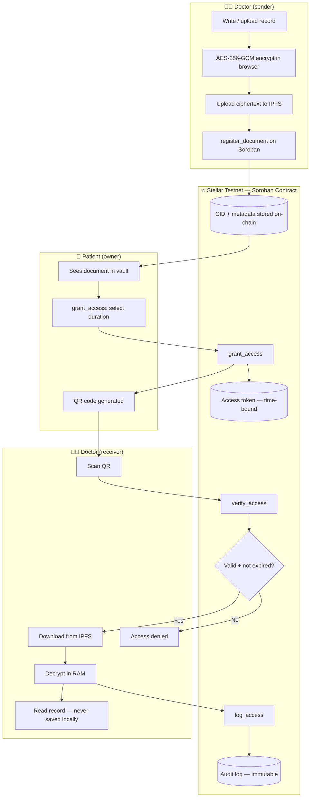
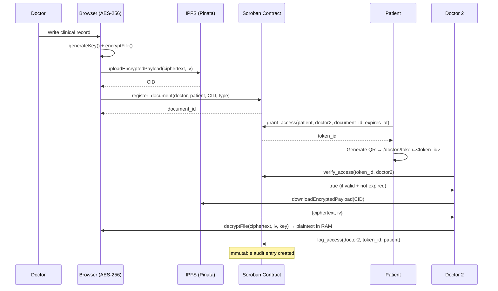

# MedVault — Sovereign Medical Records on Stellar

> Hackathon: **Stellar PULSO** (NearX + Stellar Development Foundation) · Colombia

**MedVault** gives patients full control over their medical history. Records are encrypted before leaving the browser, stored on IPFS, and access is governed by time-bound smart contracts on Stellar. Every read is logged on-chain — immutably.

**Live demo:** https://frontend-eight-virid-j7gyqph2tp.vercel.app  
**Contract (testnet):** `CC7XAXGFCQ73Y2U3RCA6OSSQRJCQCDAAIYFE2U7PHFRQOXMGABG5PGOF`  
**Explorer:** https://stellar.expert/explorer/testnet/contract/CC7XAXGFCQ73Y2U3RCA6OSSQRJCQCDAAIYFE2U7PHFRQOXMGABG5PGOF

---

## The Problem

70% of doctors in Colombia operate with vulnerable, siloed record systems. When a patient visits a new clinic, the doctor has no access to history without phone calls, signed papers, and days of waiting. Medical data is scattered, insecure, and the patient has zero control over who reads it.

## The Solution

MedVault is a **sovereign medical record vault**:

- The doctor encrypts the record with AES-256-GCM **before it leaves the device**
- The encrypted blob goes to IPFS — only the CID (content hash) is stored on Stellar
- The patient generates a **time-bound QR access token** (1h / 24h / 7 days)
- Any doctor who scans the QR can verify access on-chain and decrypt the record in RAM
- Every access is **logged immutably** on Stellar — the patient always knows who read their data

---

## Architecture



### Data Flow



---

## Stellar Integration — 3 Load-Bearing Points

Stellar is not decorative. These 3 functions make it structurally necessary:

### 1. `register_document` — on-chain document registry
The CID of every encrypted medical record is stored on Stellar, linked to the patient's wallet. No central server, no database — the chain is the registry.

### 2. `grant_access` — time-bound access tokens
Soroban is the gatekeeper. The patient calls `grant_access` with an expiration timestamp. The contract stores the token in **temporary storage** — it self-expires. No cron jobs, no server-side invalidation.

### 3. `log_access` — immutable audit trail
Every read event is written to **persistent storage** on Stellar. The patient can call `get_audit_log` to see exactly who accessed their data, from which wallet, and when.

---

## Smart Contract

**Language:** Rust (Soroban SDK v26)  
**Network:** Stellar Testnet  
**Contract ID:** `CC7XAXGFCQ73Y2U3RCA6OSSQRJCQCDAAIYFE2U7PHFRQOXMGABG5PGOF`

### Functions

| Function | Auth | Storage | Description |
|---|---|---|---|
| `register_document` | Doctor | Persistent | Register encrypted CID on-chain |
| `grant_access` | Patient | Temporary | Generate time-bound access token |
| `verify_access` | None (read) | — | Check token validity and expiry |
| `revoke_access` | Patient | Temporary | Delete token before expiry |
| `log_access` | Doctor | Persistent | Record access event in audit log |
| `get_audit_log` | Patient | — | Retrieve patient's access history |
| `get_patient_documents` | Patient | — | List all document IDs for a patient |
| `get_document` | None (read) | — | Get document metadata by ID |
| `get_token_info` | None (read) | — | Resolve document_id from token |

### Tests

```bash
cd contracts/medvault
cargo test
# 11 tests, 0 failures
```

---

## Tech Stack

| Layer | Technology |
|---|---|
| Smart contract | Rust + Soroban SDK v26 |
| Blockchain | Stellar Testnet |
| Wallet | Freighter (browser extension) |
| Encryption | AES-256-GCM via Web Crypto API (no dependencies) |
| Storage | IPFS via Pinata (free tier) |
| Frontend | React 19 + TypeScript + Vite |
| UI | shadcn/ui (new-york) + Tailwind CSS v4 |
| PWA | vite-plugin-pwa + Workbox |
| Deploy | Vercel |

---

## Local Setup

### Prerequisites

- Node.js 20+
- Rust + `rustup target add wasm32v1-none`
- Stellar CLI: `cargo install --locked stellar-cli`
- Freighter wallet browser extension

### Frontend

```bash
cd frontend
cp .env.example .env.local
# Fill in VITE_CONTRACT_ID, VITE_PINATA_JWT
npm install
npm run dev
```

### Contract (build & test)

```bash
cd contracts/medvault
cargo test                    # run all tests
stellar contract build        # compile to WASM
```

### Deploy contract to testnet

```bash
stellar keys generate deployer --network testnet
stellar network fund <PUBLIC_KEY> --network testnet
stellar contract deploy \
  --wasm target/wasm32v1-none/release/medvault.wasm \
  --source deployer \
  --network testnet
```

---

## Environment Variables

```env
VITE_CONTRACT_ID=CCQ65ECKUKP4SSSVRIHREFCU23SV3Y45O4WOBO34H3P6NUYQSR3RNXXV
VITE_SOROBAN_RPC=https://soroban-testnet.stellar.org
VITE_PINATA_JWT=<your-pinata-jwt>
VITE_PINATA_GATEWAY=gateway.pinata.cloud
```

---

## Security Model

- **AES key never stored on-chain or on IPFS** — in MVP it is shared out-of-band between doctor and patient. V2 uses ECIES with the patient's Stellar public key.
- **Decryption happens in RAM only** — the plaintext is never written to localStorage, IndexedDB, or service worker cache.
- **Service worker explicitly excludes medical data** — Soroban RPC responses and IPFS content use `NetworkFirst` / `StaleWhileRevalidate` strategies with no sensitive caching.
- **Time-bound tokens use Soroban's ledger timestamp** — not client-side JavaScript, making expiry tamper-proof.

---

## Roadmap — v2

- **ZKP access proofs** — Stellar supports BLS12-381 and Poseidon hash natively (CAP-0075). V2 will generate a zero-knowledge proof that the doctor is authorized, without revealing any health data.
- **ECIES key exchange** — encrypt the AES key with the patient's Stellar public key, eliminating out-of-band key sharing.
- **Multi-document vault** — version history, document categories, revocation.
- **Stellar Anchor integration** — for identity verification and KYC.

---

## Project Structure

```
medvault-stellar/
├── contracts/medvault/          # Soroban smart contract (Rust)
│   └── contracts/medvault/src/
│       ├── lib.rs               # Contract logic (7 functions)
│       └── test.rs              # 7 unit tests
├── frontend/                    # React PWA
│   ├── src/
│   │   ├── components/          # UI components
│   │   ├── hooks/               # useWallet, useDocuments
│   │   ├── lib/                 # encryption.ts, ipfs.ts, stellar.ts
│   │   └── pages/               # Home, PatientPage, DoctorPage
│   └── public/                  # PWA icons, favicon
└── idea.md                      # Full project context
```

---

*Built for Stellar PULSO Hackathon · June 2026 · Colombia*
