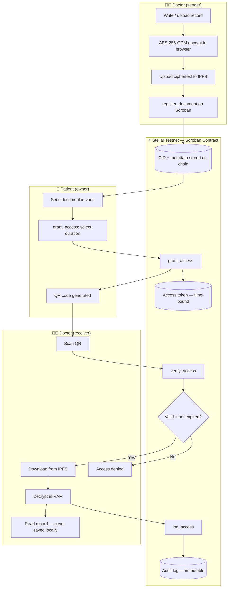
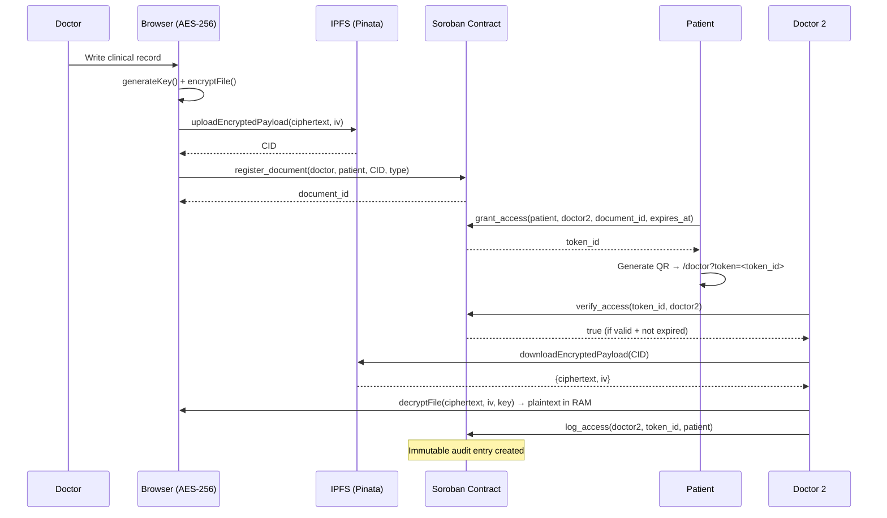
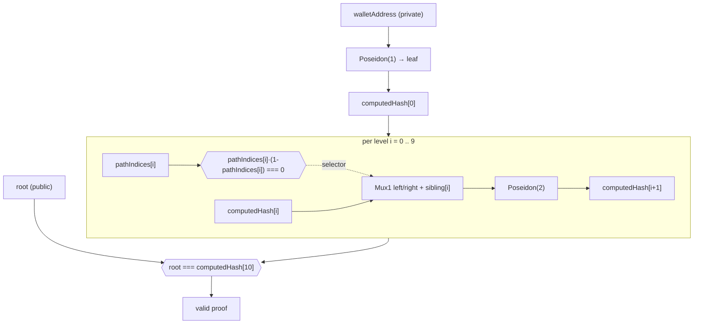

# MedVault — Sovereign Medical Records on Stellar

> Hackathon: **Stellar PULSO** (NearX + Stellar Development Foundation) · Colombia

**MedVault** gives patients full control over their medical history. Records are encrypted before leaving the browser, stored on IPFS, and access is governed by time-bound smart contracts on Stellar. Every read is logged on-chain — immutably.

**Architecture:** [ARCHITECTURE.md](./ARCHITECTURE.md) — data model, crypto design, auth model, threat model  
**Live demo:** https://medvault-stellar.vercel.app  
**Contract (testnet):** `CBYNTUAVZ4OSILWID7HE6AYF7FNOJTT2M77TZJ6GUU32VGBXUCMIUBBK`  
**Explorer:** https://stellar.expert/explorer/testnet/contract/CBYNTUAVZ4OSILWID7HE6AYF7FNOJTT2M77TZJ6GUU32VGBXUCMIUBBK

---

## The Problem

70% of doctors in Colombia operate with vulnerable, siloed record systems. When a patient visits a new clinic, the doctor has no access to history without phone calls, signed papers, and days of waiting. Medical data is scattered, insecure, and the patient has zero control over who reads it.

**And this is not hypothetical — centralized medical databases are honeypots that keep getting hit:**

- **Colombia, 2022 — Keralty / Sanitas.** The RansomHouse group breached Keralty (operator of EPS Sanitas), exfiltrated ~3 TB and **published patients' ID numbers, phones and addresses** to extort a ransom; appointment scheduling collapsed for what local press reported as ~5.5 million users. ([Infosecurity Magazine](https://www.infosecurity-magazine.com/news/ransomware-target-colombias-health/))
- **Global, 2024 — Change Healthcare.** The **largest healthcare data breach in history**: ~190 million people exposed, a US$22M ransom paid, patients unable to fill prescriptions for weeks. ([HIPAA Journal](https://www.hipaajournal.com/biggest-healthcare-data-breaches-2024/))

The common root cause is the same: patient records sit in **plaintext on a central server somebody else controls**. MedVault removes that honeypot — records are encrypted on the patient's device, so the server and IPFS only ever hold ciphertext. A full breach leaks nothing readable.

## The Solution

MedVault is a **sovereign medical record vault**:

- The doctor encrypts the record with AES-256-GCM **before it leaves the device**
- The encrypted blob goes to IPFS — only the CID (content hash) is stored on Stellar
- The patient generates a **time-bound QR access token** (1h / 24h / 7 days)
- Any doctor who scans the QR can verify access on-chain and decrypt the record in RAM
- Every access is **logged immutably** on Stellar — the patient always knows who read their data

---

## Architecture



### Data Flow



---

## Stellar Integration — 3 Load-Bearing Points

Stellar is not decorative. These 3 functions make it structurally necessary:

### 1. `register_document` — on-chain document registry
The CID of every encrypted medical record is stored on Stellar, linked to the patient's wallet. No central server, no database — the chain is the registry.

### 2. `grant_access` — time-bound access tokens
Soroban is the gatekeeper. The patient calls `grant_access` with an expiration timestamp. The contract stores the token in **temporary storage** — it self-expires. No cron jobs, no server-side invalidation.

### 3. `log_access` — immutable audit trail
Every read event is written to **persistent storage** on Stellar. The patient can call `get_audit_log` to see exactly who accessed their data, from which wallet, and when.

---

## Smart Contract

**Language:** Rust (Soroban SDK v26)  
**Network:** Stellar Testnet  
**Contract ID:** `CBYNTUAVZ4OSILWID7HE6AYF7FNOJTT2M77TZJ6GUU32VGBXUCMIUBBK`

### Functions

| Function | Auth | Storage | Description |
|---|---|---|---|
| `register_document` | `doctor.require_auth()` | Persistent | Register encrypted CID on-chain |
| `grant_access` | `patient.require_auth()` | Temporary | Generate time-bound access token (stores encrypted AES key) |
| `verify_access` | None (read) | — | Check token validity and expiry |
| `revoke_access` | `patient.require_auth()` | Temporary | Delete token before expiry |
| `log_access` | `doctor.require_auth()` | Persistent | Record access event in audit log |
| `get_audit_log` | None (read) | — | Retrieve patient's access history |
| `get_patient_documents` | None (read) | — | List all document IDs for a patient |
| `get_document` | None (read) | — | Get document metadata by ID |
| `get_token_info` | None (read) | — | Resolve document_id from token |
| `get_encrypted_key` | None (read) | — | Fetch on-chain encrypted AES key (KEM) |
| `get_doctor_tokens` | None (read) | — | List access tokens issued to a doctor |
| `verify_zkp_proof` | None (read) | — | Groth16 verification via BLS12-381 pairing (CAP-0052) |

> **Auth enforcement:** state-mutating calls invoke `require_auth()` on the acting `Address`, so a transaction only succeeds if the corresponding wallet signed it. Read functions carry no auth — Soroban ledger state is world-readable, so the privacy boundary is the *encryption layer*, not read-side access control.

### Tests

```bash
cd contracts/medvault
cargo test
# 20 tests, 0 failures
```

---

## Tech Stack

| Layer | Technology |
|---|---|
| Smart contract | Rust + Soroban SDK v26 |
| Blockchain | Stellar Testnet |
| Wallet | Stellar Wallets Kit (Freighter, xBull, Albedo, Rabet, Hana, LOBSTR, WalletConnect) |
| Encryption | AES-256-GCM via Web Crypto API (no dependencies) |
| Storage | IPFS via Pinata (free tier) |
| Frontend | React 19 + TypeScript + Vite |
| UI | shadcn/ui (new-york) + Tailwind CSS v4 |
| PWA | vite-plugin-pwa + Workbox |
| Deploy | Vercel |

---

## Local Setup

### Prerequisites

- Node.js 20+
- Rust + `rustup target add wasm32v1-none`
- Stellar CLI: `cargo install --locked stellar-cli`
- A Stellar wallet (Freighter, xBull, Albedo, Rabet, Hana, LOBSTR, or WalletConnect)

### Frontend

```bash
cd frontend
cp .env.example .env.local
# Fill in VITE_CONTRACT_ID, VITE_PINATA_JWT
npm install
npm run dev
```

### Contract (build & test)

```bash
cd contracts/medvault
cargo test                    # run all tests
stellar contract build        # compile to WASM
```

### Deploy contract to testnet

```bash
stellar keys generate deployer --network testnet
stellar network fund <PUBLIC_KEY> --network testnet
stellar contract deploy \
  --wasm target/wasm32v1-none/release/medvault.wasm \
  --source deployer \
  --network testnet
```

---

## Environment Variables

```env
VITE_CONTRACT_ID=CBYNTUAVZ4OSILWID7HE6AYF7FNOJTT2M77TZJ6GUU32VGBXUCMIUBBK
VITE_SOROBAN_RPC=https://soroban-testnet.stellar.org
VITE_PINATA_JWT=<your-pinata-jwt>
VITE_PINATA_GATEWAY=gateway.pinata.cloud
```

---

## Security Model

- **Plaintext never leaves the browser** — files are encrypted with AES-256-GCM (Web Crypto `SubtleCrypto`, 96-bit random IV per file) before any network call. IPFS and Stellar only ever see ciphertext or hashes.
- **The AES key is wrapped, never stored in clear** — a random 256-bit wrapping key encrypts the AES key; the wrapped key is stored on-chain (`AccessToken.encrypted_key`) and the wrapping key travels only in the URL fragment (`#wk=`), which browsers never send to servers. Decryption requires *both* the on-chain token and the link.
- **Write authorization is enforced on-chain** — `register_document`, `grant_access`, `log_access`, and `revoke_access` call `require_auth()` on the acting address. Soroban rejects the invocation unless that wallet authorized the call, so no third party can register documents, mint tokens, forge audit entries, or revoke another patient's grants.
- **Expiry is tamper-proof** — `verify_access` compares against `env.ledger().timestamp()` (consensus ledger time), not client clocks. Tokens live in **temporary storage** and are evicted by the network after their TTL — no server-side invalidation job exists.
- **Decryption happens in RAM only** — plaintext is never written to `localStorage`, `IndexedDB`, or the service-worker cache. The service worker uses `NetworkFirst` / `StaleWhileRevalidate` and explicitly excludes Soroban RPC and IPFS payloads from precaching.
- **Audit trail is append-only** — every `log_access` writes to **persistent storage**; there is no contract path that mutates or deletes existing audit entries.

---

## Zero-Knowledge Verification (working POC)

`verify_zkp_proof` runs a full Groth16 verification on-chain using Stellar's native BLS12-381 pairing host function — `env.crypto().bls12_381().pairing_check` (CAP-0052). The circuit (`merkle_membership_stellar.circom`, Poseidon over the BLS12-381 scalar field) proves a wallet belongs to the authorized-doctor Merkle set without revealing which member it is.



The full circuit, its soundness/booleanity suite, and the on-chain verifier reference live in [`zkp-jwt/stellar/`](../zkp-jwt/stellar/README.md). `pathIndices` are explicitly constrained to `{0,1}` to close an under-constraint in circomlib's `Mux1` (its selector is otherwise not range-checked).

- **Curve/encoding** — G1 points are 96 bytes (`x‖y`, 48 each, big-endian); G2 points are 192 bytes with Fp2 components in `c1`-first order (`x.c1‖x.c0‖y.c1‖y.c0`), matching Stellar's zkcrypto serialization.
- **Pairing equation** — `e(−A, B)·e(α, β)·e(L, γ)·e(C, δ) = 1`, where `L = IC₀ + root·IC₁` (single public input: the Merkle root).
- **Prover** — Poseidon must be computed over the BLS12-381 scalar field with circomlib's *optimized* round constants (sparse MDS), not the BN254 defaults shipped by `circomlibjs`. The browser implements it in pure `BigInt` (`frontend/src/lib/zkp/poseidon.ts`); the Node reference is `zkp-jwt/stellar/test/bls_poseidon.mjs`.
- **In-browser proving** — the Protocol page generates the full Groth16 proof client-side with snarkjs (circuit wasm + zkey served statically, read via HTTP Range), then calls `verify_zkp_proof` on the live contract. End-to-end (build Merkle tree → prove → on-chain verify) runs in ~2 s.
- **Reproduce (Node)** — `cd zkp-jwt/stellar && DUMP_FIXTURE=1 node test/verify_onchain.mjs` generates a proof and invokes the deployed contract; returns `true`.

## Roadmap — v2

- **Production trusted setup** — the current zkey uses a single dev contribution; a multi-party ceremony is required before mainnet.
- **TTL extension on `grant_access`** — call `extend_ttl` on the temporary token entry to guarantee it survives until `expires_at` for long-lived grants (e.g. the 7-day option), independent of the network's default temporary TTL.
- **ECIES key exchange** — encrypt the AES key with the patient's Stellar public key, eliminating out-of-band key sharing.
- **Multi-document vault** — version history, document categories, revocation.
- **Stellar Anchor integration** — for identity verification and KYC.

---

## Project Structure

```
medvault-stellar/
├── contracts/medvault/          # Soroban smart contract (Rust)
│   └── contracts/medvault/src/
│       ├── lib.rs               # Contract logic (12 functions)
│       └── test.rs              # 20 unit tests
├── frontend/                    # React PWA
│   ├── src/
│   │   ├── components/          # UI components
│   │   ├── hooks/               # useWallet, useDocuments
│   │   ├── lib/                 # encryption.ts, ipfs.ts, stellar.ts
│   │   └── pages/               # Home, PatientPage, DoctorPage
│   └── public/                  # PWA icons, favicon
└── idea.md                      # Full project context
```

---

*Built for Stellar PULSO Hackathon · June 2026 · Colombia*
